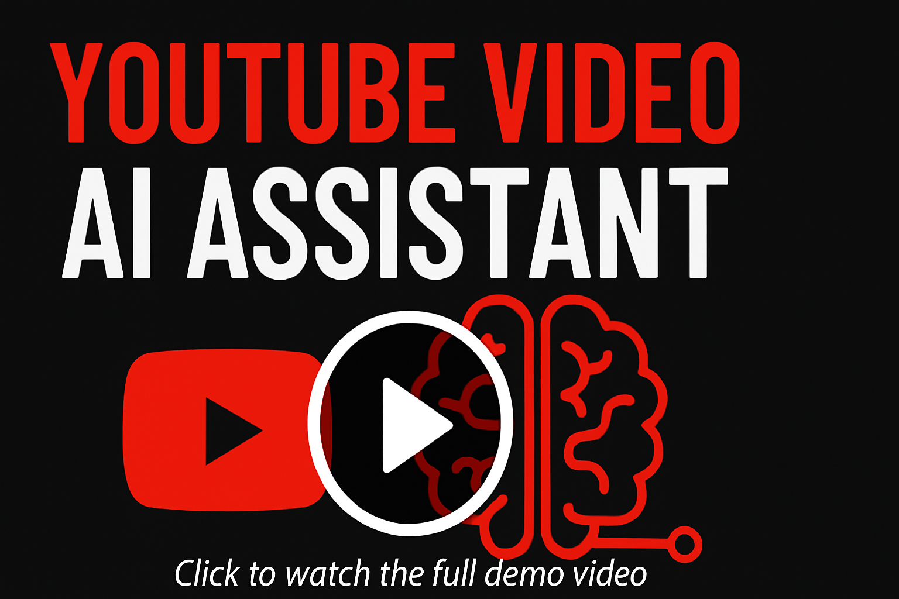
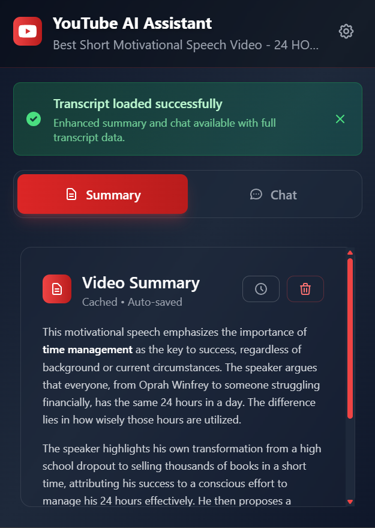
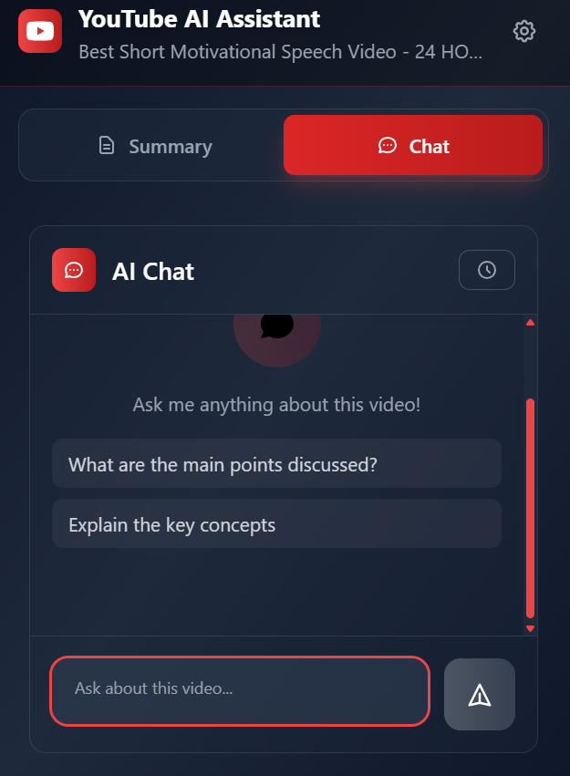
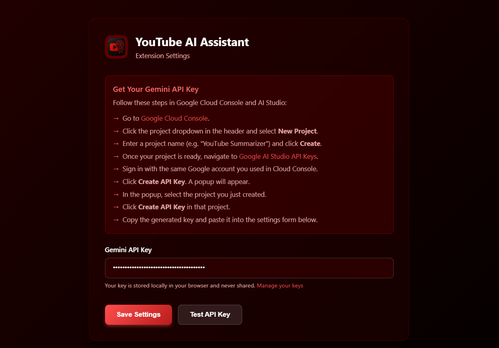
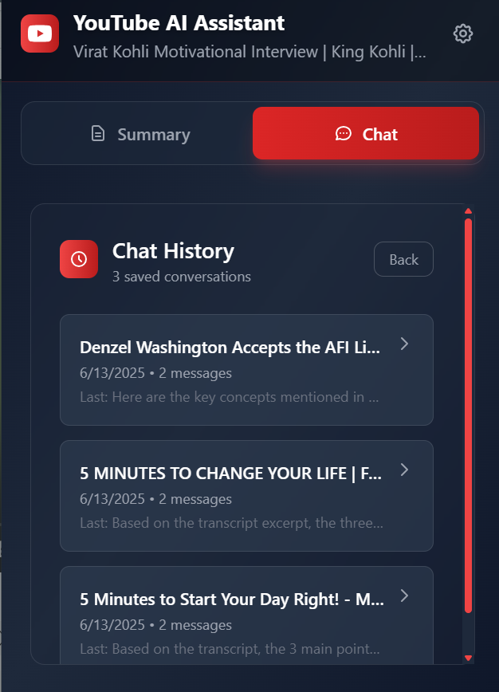
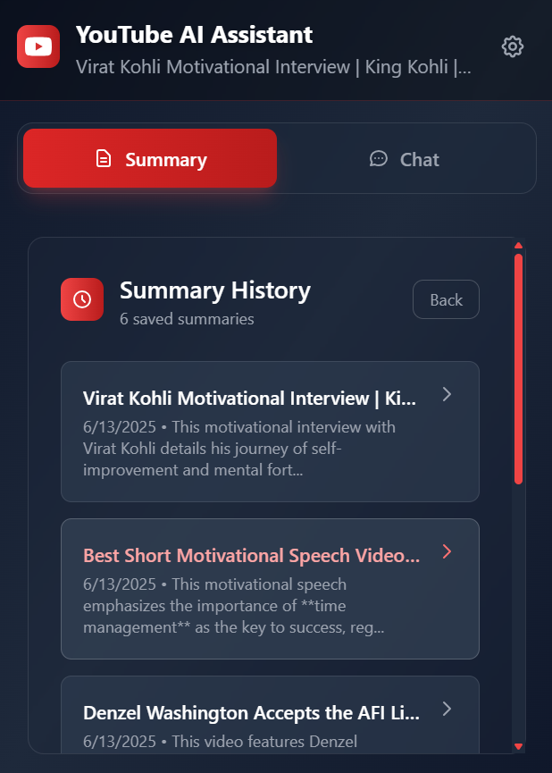

# YouTube AI Assistant Chrome Extension

A powerful Chrome extension that uses Google's Gemini AI to summarize YouTube videos and provide interactive chat functionality. Get instant insights from any YouTube video without watching the entire content.


## 🎬 Demo

### Video Walkthrough

<div align="center" style="max-width:360px;margin:auto;">
    <a href="https://www.dropbox.com/scl/fi/c4j7gu07xk1p09arrsbso/youtube-ai-assistant-demo.mp4?rlkey=lggk8lp2v5layt87zq2qd4ry8&st=q6eahmzu&dl=0" target="_blank" style="display:inline-block;position:relative;">
        
        
    </a>
    <div style="margin-top:8px;font-size:0.95em;color:#888;">
        <em>Click to watch the full demo video</em>
    </div>
</div>


### Screenshots

#### Video Summary


*AI-generated summary with markdown formatting*

#### Interactive Chat


*Chat interface with conversation history*

#### Settings Page


*API key configuration and testing*

#### History Management - Chat and Summary



*Access to previous summaries and chats*


## 🎯 Features

### 📝 AI-Powered Video Summaries
- **Instant Summaries**: Generate comprehensive summaries of YouTube videos using Gemini AI
- **Transcript Analysis**: Automatically extracts and analyzes video transcripts when available
- **Smart Caching**: Summaries are cached locally for 7 days to save API calls
- **History Management**: View and access previously generated summaries

### 💬 Interactive AI Chat
- **Video Context Chat**: Ask specific questions about the video content
- **Conversation History**: Maintains chat history for each video
- **Cross-Video Chat**: Access chat history from different videos
- **Smart Responses**: AI understands video context and provides relevant answers

### ⚙️ User-Friendly Settings
- **API Key Management**: Secure storage of your Gemini API key
- **Key Validation**: Test your API key before saving
- **Easy Setup**: Step-by-step instructions to get your API key

### 🎨 Modern UI/UX
- **Dark Theme**: Sleek, modern interface optimized for readability
- **Smooth Animations**: Polished interactions with fade-in effects
- **Status Indicators**: Clear feedback for loading states and errors

## 🚀 User Flow

### First Time Setup
1. **Install Extension** → Load the extension in Chrome
2. **Open Settings** → Click the gear icon in the popup
3. **Get API Key** → Follow the provided instructions to get a Gemini API key
4. **Configure** → Enter and test your API key
5. **Ready to Use** → Start summarizing videos!

### Daily Usage
1. **Navigate to YouTube** → Open any YouTube video
2. **Open Extension** → Click the extension icon in the toolbar
3. **Get Summary** → Automatically generates summary if transcript is available
4. **Ask Questions** → Switch to chat tab to ask specific questions
5. **Access History** → View previous summaries and chats anytime

### Workflow Diagram
```
YouTube Video → Extension Popup → Summary/Chat → History
     ↓              ↓               ↓           ↓
  Auto-detect → Transcript → AI Analysis → Local Storage
```

## 🛠️ Local Development Setup

### Prerequisites
- Node.js (v16 or higher)
- npm or yarn
- Chrome browser
- Gemini API key from Google AI Studio

### Installation Steps

1. **Clone the Repository**
   ```bash
   git clone https://github.com/Shrey-Raj/youtube-ai-assistant-chrome-ext
   cd youtube-ai-assistant-chrome-ext
   ```

2. **Install Dependencies**
   ```bash
   npm install
   ```

3. **Build the Extension**
   ```bash
   # For development (with watch mode)
   npm run watch
   
   # For production build (suggested)
   npm run build
   ```

4. **Load Extension in Chrome**
   - Open Chrome and navigate to `chrome://extensions/`
   - Enable "Developer mode" (toggle in top-right)
   - Click "Load unpacked"
   - Select the `dist` folder from your project directory

5. **Configure API Key**
   - Click the extension icon in Chrome toolbar
   - Click the settings gear icon
   - Follow the instructions to get a Gemini API key
   - Enter and test your API key

### Development Commands

```bash
# Start development server with hot reload
npm run watch

# Build for production
npm run build

# Start webpack dev server (for testing)
npm run dev
```

### Project Structure
```
src/
├── background/          # Service worker
├── content/            # Content scripts
├── popup/              # Main extension popup
│   ├── components/     # React components
│   └── App.tsx        # Main app component
├── options/           # Settings page
├── utils/             # Utility functions
└── types/             # TypeScript definitions

public/
├── manifest.json      # Extension manifest
├── icons/             # Extension icons
└── previews/          # Screenshots and preview images

dist/                 # Built extension (generated)
```

## 🔧 Technical Details

### Architecture
- **Frontend**: React 19 with TypeScript
- **Styling**: Tailwind CSS with custom dark theme
- **Build Tool**: Webpack 5
- **AI Integration**: Google Generative AI (Gemini)
- **Storage**: Chrome Extension Storage API

### Key Technologies
- **React 19**: Modern React with hooks and concurrent features
- **TypeScript**: Type-safe development
- **Tailwind CSS**: Utility-first CSS framework
- **Chrome Extensions Manifest V3**: Latest extension platform
- **Google Gemini AI**: Advanced language model for summaries and chat

### Browser Compatibility
- Chrome 88+ (Manifest V3 support)
- Chromium-based browsers (Edge, Brave, etc.)

## 📋 API Requirements

### Gemini API Setup
1. Visit [Google AI Studio](https://aistudio.google.com/apikey)
2. Create a new project or select existing one
3. Generate an API key
4. Enable the Generative AI API
5. Configure usage limits as needed (optional)

### API Usage
- **Model**: `gemini-2.0-flash-lite`
- **Rate Limits**: Follows Google AI Studio limits
- **Caching**: 7-day local cache to minimize API calls
- **Error Handling**: Comprehensive error messages for different scenarios

## 🔒 Privacy & Security

### Data Handling
- **API Keys**: Stored securely in Chrome's encrypted storage
- **Video Data**: Only video IDs and titles are stored locally
- **Transcripts**: Processed locally, not stored permanently
- **No External Servers**: Direct communication with Google AI only

### Permissions
- `tabs`: Access current tab information
- `activeTab`: Read YouTube video details
- `scripting`: Inject content scripts for transcript extraction
- `storage`: Store summaries, chats, and settings
- `host_permissions`: Access YouTube pages only

## 🐛 Troubleshooting

### Common Issues

#### "Please set your Gemini API key"
- **Solution**: Open settings and configure your API key
- **Check**: Ensure the key is valid and has proper permissions

#### "No transcript available"
- **Cause**: Video doesn't have captions or transcript
- **Solution**: Extension will still generate summary based on title
- **Tip**: Try clicking "Try Loading Transcript" button

#### "API quota exceeded"
- **Cause**: You've reached your Gemini API usage limit
- **Solution**: Check your usage in Google AI Studio
- **Prevention**: Cached summaries reduce API calls

#### Extension not loading
- **Check**: Ensure you're on a YouTube video page
- **Verify**: Extension is enabled in Chrome extensions page
- **Reload**: Try refreshing the YouTube page

### Debug Mode
Enable Chrome Developer Tools for the extension:
1. Go to `chrome://extensions/`
2. Find "YouTube AI Assistant"
3. Click "Inspect views: popup"

## 🤝 Contributing

### Development Guidelines
1. Follow TypeScript best practices
2. Use Tailwind CSS for styling
3. Maintain component modularity
4. Add proper error handling
5. Update tests for new features

### Pull Request Process
1. Fork the repository
2. Create a feature branch
3. Make your changes
4. Test thoroughly
5. Submit a pull request

## 📄 License

This project is licensed under the MIT License - see the [LICENSE](LICENSE) file for details.

## 🙏 Acknowledgments

- Google AI Studio for Gemini API
- YouTube for transcript accessibility
- Chrome Extensions team for Manifest V3
- React and Tailwind CSS communities

## 📞 Support

For issues, questions, or feature requests:
- Create an issue on GitHub

---

**Made with ❤️ for the community**

*Transform how you consume video content with AI-powered insights*